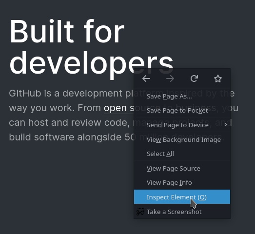
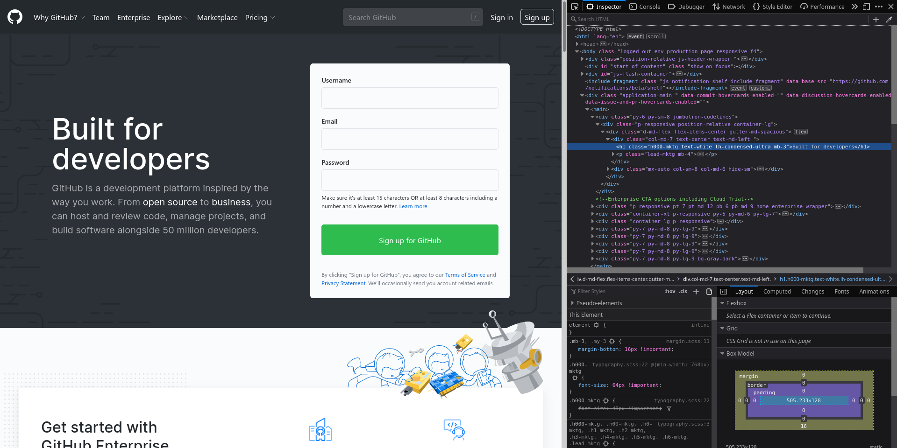
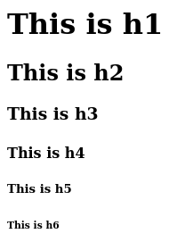

# 07/01/20: Introduction to HTML and CSS

With Matt and Leo, we will discuss the fundamental languages of the web: HTML and CSS. With them, we will learn how to get started creating a basic website! Here are our learning goals for the lesson along with links to each header:
* What are they used for?
* Basic HTML tags (headers, paragraph, link, img, lists, div, span)
* Basic properties of tags (href, anchor)
* How to use CSS to style things (basic props like color, bg color, border, font size, font weight, basic dimensions)
* Discuss first project: portfolio!

After completing this, you will be able to structure a basic website, style its components, and connect it to other resources on the web!

# HTML

## What is HTML?

Have you ever used the "inspect element" feature of your web browser? If you haven't go take a look at [any webpage at all](https://github.com), right click, and click the "inspect element" button:



You'll be greeted with something that looks a little bit like this:



What you're looking at right now in that inspect element panel is **HyperText Markup Language (more commonly abbreviated HTML)** - one of the three languages (four if you want to count PHP) that drive the web. **It is an interpreted, declarative, tree-structured document formatting language** that is processed by your web browser.

That is, an HTML file isn't compiled, and nothing special needs to be done to it for your web browser to understand it. As for the rest of that definition, it might sound like a bunch of words right now, but by the end of this lesson, you should be able to understand (and explain) what it all means.

But first, let's start with the basics.

## What's in an `index.html`?

Files containing HTML code are called **documents**, in the same way that the file you're reading right now is a markdown **document**. HTML is intended to be an easy-to-learn, easy-to-use markup language whose contents still make some sort of sense to the untrained eye. But, like a great deal of file types, they require a small amount of unintuitive information to indicate the purpose of their contents.

In the case of HTML, this means that your file extension needs to be `.html`, and the first line in the file needs to be:

```html
<!DOCTYPE html>
```

This is just a line to tell your web browser that the contents of this document are HTML, and to process it as such. The `DOCTYPE` portion of this isn't case sensitive, but while `<!doctYpE html>` works all the same, most people stick to either all uppercase or all lowercase.

Next, we declare a few basic areas of our code.

```html
<!DOCTYPE html>
<html>
    <head>
        This is where the head is!
    </head>
    <body>
        This is where the body is!
    </body>
</html>
```

Just looking at this code might be unfamiliar or hard to follow, but the best part of frontend development is that you can always take a look at what your work looks like directly in your web browser!

With that, let's go ahead and save this file as, say, [`index.html`](./index.html), and open it in the web browser of your choice. You should see something like this:


Of course, everyone's operating systems and web browsers vary, so what you see might not be exactly the same (if you changed your system's defualt fonts, for example), but you should see something at least a little bit similar.

### What's special about `index.html`?

It may have seemed like an odd choice to use the filename "index". There's a deliberate reason behind this.

...

Now, before we move on, we should also talk about comments in HTML. If we want to leave a note to ourselves for later on, we can simply add one by surrounding its contents with `<!--` and `-->`. For example: `<!-- THIS IS MY COMMENT -->`. Be careful with comments in an HTML document though! Since this document is read directly by the web browser, anyone on the Internet with access to it will be able to read your comments as well by just downloading the source. In short, **don't put any sensitive information in an HTML comment!**

Now that we have a grip on what we wrote actually looks like in the browser, let's start analyzing what's going on here. To do that, we're going to have to begin with the most essential part of HTML: **tags**.

## Tags

HTML is, at its core, structured with the "atoms" of your webpage called **tags**, which surround plain text and/or other tags.

The start of a tag (its **opening**) is its name in angle brackets, like this: `<tagName>`. A tag is ended or **closed** in angle brackets with a forward slash at the start, like this: `</tagName>`.

For example, `<head>this is surrounded by 'head' tags!</head>`.

Or `<h1>this is a sentence surrounded by 'h1' tags!</h1>`.

So looking back at [`index.html`](./index.html):

```html
<!DOCTYPE html>
<html>
    <head>
        This is where the head is!
    </head>
    <body>
        This is where the body is!
    </body>
</html>
```

We can see the three areas are encapsulated by tags:
* html
* head
* body

### `<html>`

This is the **root** of our document. It is where all other parts of your HTML document are intended to fall under.

### `<head>`

This is where all the things that you would prefer the web browser not to render go. Though we haven't gotten there quite yet, there are particular tags in HTML that connect resources on the web that you would put here. There are also tags that provide information about your document to other resources on the web, such as search engines or indexers.

### `<body>`

This is where all the things that you would like for the web browser to render go.

### Interlude to more tags

Great! So now we understand the basics of our webpage structure, but it should go without saying that these three tags aren't the only ones we can use. Think about how boring the web would be without variety!

To start our investigation into the other tags at our disposal, recall our example using the 'h1' tag: `<h1>this is a sentence surrounded by 'h1' tags!</h1>`.

If tags are used to identify and encapsulate areas of our document, what does this 'h1' tag do?

### `<h1>`

The 'h1' tag stands for **header [of size] 1**. That is, **it makes the contained text big and bold**. There are six versions of the header tag, in descending order of magnitude. Since markdown headers follow the same conventions, we can take a look at them below:

# h1
## h2
### h3
#### h4
##### h5
###### h6

Let's also take a look at what those might look like on the page. While we're at it, let's comment out our text that we don't want rendered from the `<head>` tag to guarantee it won't be rendered.

```html
<!DOCTYPE html>
<html>
    <head>
        <!-- This is where the head is! -->
    </head>
    <body>
        <h1>This is h1</h1>
        <h2>This is h2</h2>
        <h3>This is h3</h3>
        <h4>This is h4</h4>
        <h5>This is h5</h5>
        <h6>This is h6</h6>
    </body>
</html>
```

Opening up [`index.html`](./index.html) in our web browser once more, here's what the page looks like.



From here, let's investigate a few other tags that are essential to know.

### `<p>`

The 'p' tag is a **paragraph**. It keeps text nice and tidy. Here's what it looks like when we add `<p>This is a paragraph</p>` to our page:

```html
<!DOCTYPE html>
<html>
    <head>
        <!-- This is where the head is! -->
    </head>
    <body>
        <h1>This is h1</h1>
        <h2>This is h2</h2>
        <h3>This is h3</h3>
        <h4>This is h4</h4>
        <h5>This is h5</h5>
        <h6>This is h6</h6>

        <p>And here's our paragraph with lots of text in it.</p>
    </body>
</html>
```

Opening our file once more in a web browser, this is what we see:

TODO: IMAGE

### `<span>`

A span doesn't do anything to your text aside from display it to your screen. This is because its intended use is to help markup part of another text element. That means that it is intended to be used like this: `<p>This is a <span>marked-up</span> paragraph!</p>`.

This said, you can still use it on its own.

Let's add one to [`index.html`](./index.html)!

### `<ol>`, `<ul>`, and `<li>`

These tags compose lists in HTML. 'ol' stands for '**ordered list**', while 'ul' stands for '**unordered list**'. What does that look like?

1. This
2. is
3. an
4. **ordered**
5. list!

* This
* is
* an
* **unordered**
* list!

We've covered two of the three, which leaves 'li' - a **list item**. Inside of your list container tags, place `<li>` tags to declare the elements of the list. This way, if you want to change the display style of a list from ordered to unordered, or vice versa, all you need to do is change the container tags.

...

### `<div>`

...

### ``

...

### `<a>`

The 'a' tag is a **hyperlink**. It allows you to create links from your page to others.

Why is it 'a' and not 'h', or 'hyper'? Historically, 'a' stands for **anchor**, as in, where the **anchor** [of a hyperlink] begins and ends.

...

### `<link>`

The 'link' tag links your page to another resource, while defining the relationship between the two.

...

### Tags: In Summary

To summarize, we have a variety of HTML tags to declare areas of our page and the properties they may have. At the minimum, we learned:
* Headers
* Paragraphs
* Hyperlinks
* Images
* Ordered and unordered lists
* Divs
* Spans
* Links

But this is just the beginning of the tags in HTML. Although many of them don't see their fair share of use, there are a variety for you to investigate on [w3schools' list](https://www.w3schools.com/TAGS/default.ASP).

## What it means to be "tree-structured"

## Properties

Tags all have properties, as well. We have avoided talking about them until now, but the idea behind them is that before one writes the `>` at the end of a tag's opening, they can specify certain properties about that particular tag, or pass it certain values. Think of it kind of like the constructor list of an object in a traditional object-oriented langauge!

To specify a property of a tag, the format is `<tagName propName="propValue" anotherPropName="propValue1 propValue2>`. Notice that you can have multiple properties on a tag, as well as multiple values passed to a single property. Looking at this format, can you think of some examples we've already seen?

If you recall, we've already seen a few properties in action:
* The `src=""` in our `` tag
* The `href=""` in our `<link>`s and `<a>`s
* The `type=""` and `rel=""` in our `<link>`

These properties are specific to those tags, though, so let's talk about the properties that all drawable tags have: **class and id**. These properties don't change anything about the appearance of the tag they are applied to immediately, but if we `<link>` the right resources to our HTML document later on, we can customize tags by targeting those that match particular properties.

### Class

We can designate a particular tag on our page as a particular class of tag with this property.

# Styling with CSS

At this point, there are likely a handful of questions about properties floating around. Why do we need them? What's the point of a `<link>`? What if we want to spice up our website? Add some color, change the size of things, the font maybe?

This is where the last two S's of CSS come in: "Cascading **Style Sheets**".

That's rather self-explanatory! CSS is the language used to dictate any sort of styling changes to our site we wish to make.

Why are they cascading? That's pretty easy to see when you look at CSS in the flesh:

```css
h1 {
    font-size: 3em;
}

p {
    font-family: Comic Sans MS;
}

div {
    background-color: #bae;
}
```

Styling *cascades* through a long file.

## Reading CSS

CSS is written fairly simply:

```css
selector {
    propertyName: value;
    otherProperty: otherValue;
}
```

The **selector** can be [one of a variety of properties](https://www.w3schools.com/cssref/css_selectors.asp), but for our purposes, we'll discuss three properties we talked about: tag name, class, and ID.

To select a **class** of elements on the page, we prepend the class name with a dot (`.`). To select the "big" class from our page and change the styling of it, we would write:

```css
.big {
    /* ... */
}
```

To select all elements that have a **list of classes**, we list them one after another with `.`. To select all elements from our page with a class list containing both "big" and "title", we would write:

```css
.big.title {
    /* ... */
}
```

To select an element by its **ID**, we prepend the ID name with a hash (`#`). To select the "title" ID from our page, we would write:

```css
#title {
    /* ... */
}
```

If you have multiple items with the same ID, this styling will apply to both of them, but you should generally only keep a 1:1 mapping of IDs to elements of your document.

## Linking CSS files to our webpage

...

## Writing CSS

...

## Basic CSS: Summary

...

# Project One: Building a Portfolio

The best part of frontend development is that much of what you learn is immediately applicable! So what can you do with your knowledge of HTML and CSS? Build a portfolio website for yourself!

Try building off of the sample code we have been developing throughout this document or writing your own from scratch.

# Reference

Much of this document relies on [w3schools](https://www.w3schools.com/) for reference.

Below are some links for you to use as reference for the material we covered today:
* [A list of all HTML tags](https://www.w3schools.com/TAGS/default.ASP)
* ...

If you'd like to learn even more material and dive even deeper in, here's some links for further reading:
* [A list of all CSS selectors](https://www.w3schools.com/cssref/css_selectors.asp)
* [A comprehensive list of all CSS properties](https://www.w3schools.com/cssref/)
* ...